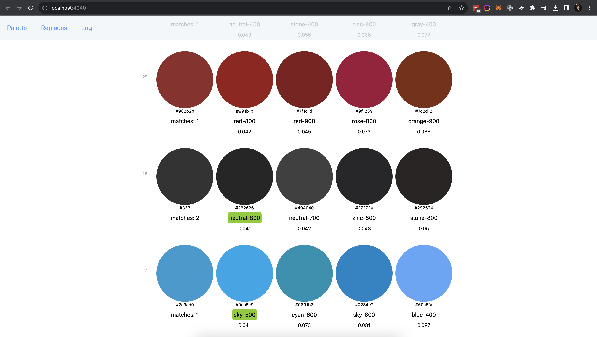
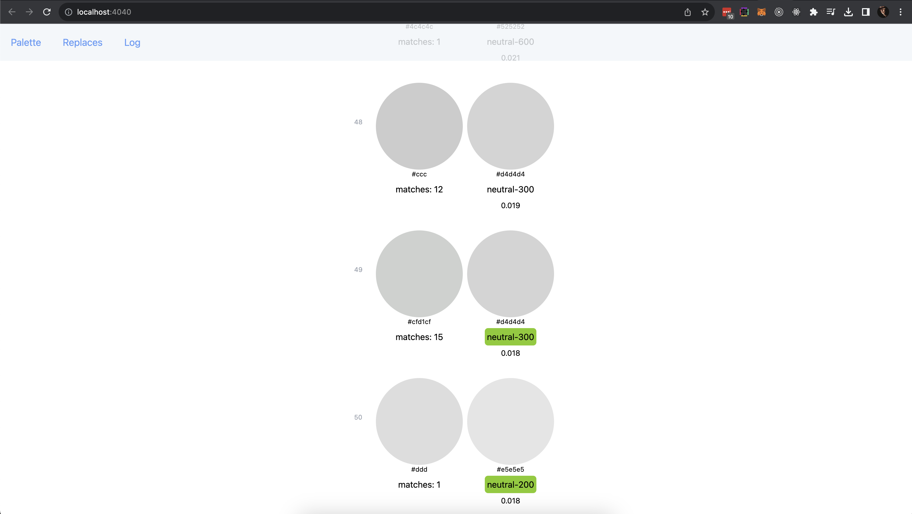
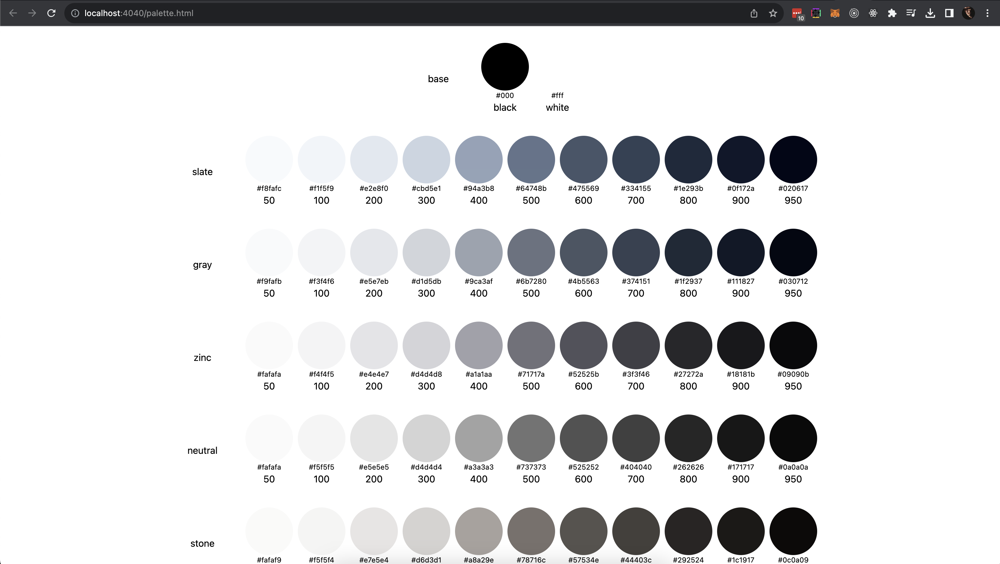
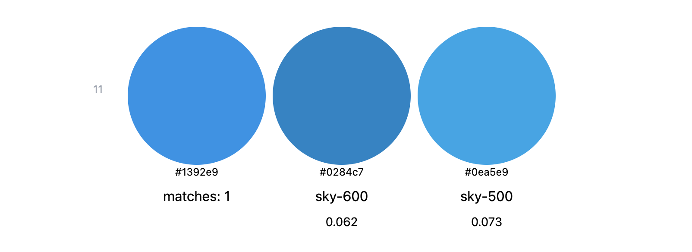

<p align="center">
  <a href="" rel="noopener">
 </a>
</p>

<h3 align="center">ZIMABLUE</h3>

<div align="center">

[]()
[](https://github.com/sendsay-ru/color-palette/actions/workflows/check-prod.yml)
[](https://github.com/sendsay-ru/color-palette/issues/issues)
[](https://github.com/sendsay-ru/color-palette/issues/pulls)
[](/LICENSE)

</div>

---

<p align="center">a CLI utility for matching colors with a given palette
    <br> 
</p>

## 📝 Table of Contents

- [📝 Table of Contents](#-table-of-contents)
- [🧐 About ](#-about-)
- [🏁 Getting Started ](#-getting-started-)
- [🎈 Usage ](#-usage-)
- [👀 Find colors ](#-find-colors-)
- [🌂 Ignore files ](#-ignore-files-)
- [🔆 Delta ](#-delta-)
- [🎨 Custom palette ](#-custom-palette-)
- [👭 Siblings ](#-siblings-)
- [✏️ Make replaces ](#️-make-replaces-)
- [✍️ Authors ](#️-authors-)

## 🧐 About <a name = "about"></a>

This package helps to compare all the colors used in a project with a pre-configured palette. The script finds colors in the specified files, converts them to a HEX format and then prints them together with the most similar colors from the palette as a table.

## 🏁 Getting Started <a name = "getting_started"></a>

Run this command in the root directory of your project:

```
npx zimablue --files ./**/*.css -i node_modules --delta 0.041 -n 4
```

The web interface will start on `localhost:4040`<br>


## 🎈 Usage <a name="usage"></a>

Usage: zimablue [options]

```
npx zimablue --help
```

```
Options:
  -f --files [files...]   path to files
  -p --palette <string>   path to custom palette config
  -i --ignore [files...]  ignore files
  -d --delta <number>     max delta when comparing files, min:0, max:1, default: 0.034
  -n --number <number>    number of relevant colors
  -r --replace            make replaces in files
  --no-vars               do not use vars
  --no-server             do not start the server
  -V, --version           output the version number
  -h, --help              display help for command
```

## 👀 Find colors <a name="find-colors"></a>

Use the "files" option to properly configure color parsing.<br> Examples:

Find colors in all css files:

```
npx zimablue -f './**/*.css'
```

Only files with the name `colors.css`:

```
npx zimablue --files ./**/colors.css
```

Find colors in two different packages:

```
npx zimablue -f './package_one/*.css' './package_two/*.css'
```

<b>warning:</b> please use single quotes if there are two or more entries

## 🌂 Ignore files <a name="ignore-files"></a>

Use the "ignore" flag to exclude files from parsing:

```
npx zimablue --ignore node_modules
```

or

```
npx zimablue -i legacy /build/ reset.css
```

## 🔆 Delta <a name="delta"></a>

[Delta](https://en.wikipedia.org/wiki/Color_difference#CIEDE2000) is a color difference threshold below which two colors are considered as equal. Min: 0 (same colors), max: 1 (e.g. black and white):

```
npx zimablue -f './**/*.css' -d 0.018
```



## 🎨 Custom palette <a name="palette"></a>

By default, [tailwind colors](https://tailwindcss.com/docs/customizing-colors) are used as a reference, but you can create your own palette and compare colors with it. To do this, create a custom config file "my-palette.json":

```
[
  {
    "hex": "#000",
    "name": "black",
    "group": "base",
    "var": "--ss-color-black"
  },
  {
    "hex": "#fff",
    "name": "white",
    "group": "base",
    "var": "--ss-color-white"
  },
  {
    "hex": "#f8fafc",
    "name": "primary",
    "group": "app",
    "var": "--color-primary"
  },
  {
    "hex": "#9c95dc",
    "name": "secondary",
    "group": "app",
    "var": "--color-secondary"
  }
]
```

in this config:

- `hex` - color in hex format, [required]
- `name` - color name
- `group` - color group
- `var` - use this field if you want to replace colors with variables

<br>

Then you can use it like this:

```
npx zimablue -p ./my-palette.json
```



## 👭 Siblings <a name="siblings"></a>

Number of similar colors, 1 by default.

```
npx zimablue -f ./**/*.css -n 2
```



<br>
<br>

```
npx zimablue -f ./**/*.css -n 3
```


## ✏️ Make replaces <a name="replace"></a>

Use the "--replace" flag to make changes in files:

```
npx zimablue -f ./**/*.css -p ./my-palette.json --replace
```

## ✍️ Authors <a name = "authors"></a>

- [@aleksnick](https://github.com/aleksnick) - Idea & Initial work, [contact in telegram](https://t.me/aleksnick)
